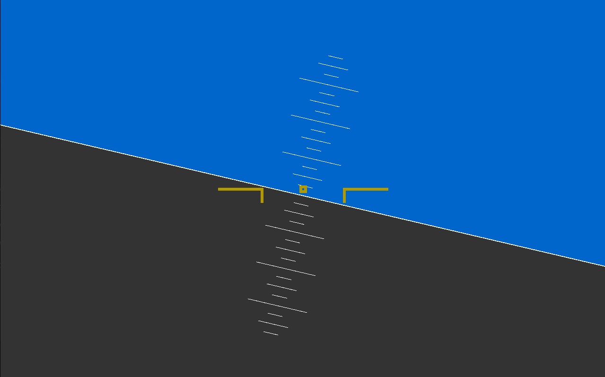

# Avionics

## Overview
A work in progress avionics application designed to interface with X-Plane 11.
Current project status displays a very basic attitude indicator of a Primary
Flight Display. Accepts an incoming UDP stream from X-Plane 11.

